

# TSX

## Índice
- [1. Props](#1-props)
- [1.1. PropsWithChildren](#11-propswithchildren)
- [1.2. ComponentProps](#12-componentprops)
- [1.3. Desestruturação](#13-desestruturação)
- [1.3.1. ...props ou ...rest](#131-props-ou-rest)
- [1. Propriedade opcional](#14-propriedade-opcional)
- [2. Interfaces e tipos](#2-interfaces-e-tipos)
- [2. 1. JSX.Element](#21-jsxelement)
- [3. Eventos](#3-eventos)
- [3.1. EventHandler](#31-eventhandler)
- [3.1.1 Função Anônima](#311-função-anônima)
- [4. Hooks TSX](#4-hooks-tsx)
- [4. useState](#41-usestate)
### 1. Props
É preciso anotar as props que um componente recebe.

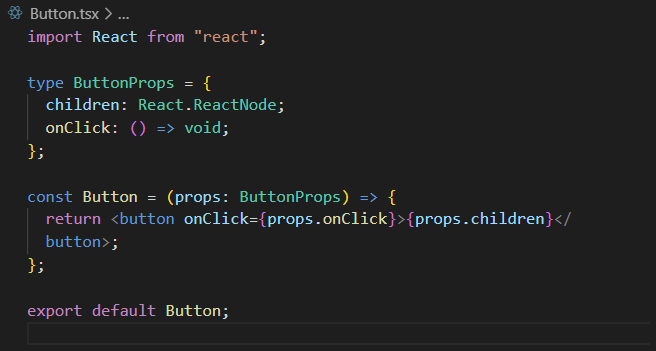

__Tipo ReactNode__: No ReactJS com TypeScript, ReactNode é um tipo que representa um elemento React, um array de elementos React ou uma string, número ou booleano. É definido no módulo react e pode ser usado para especificar o tipo de variável que pode conter qualquer um desses tipos.

#### 1.1. PropsWithChildren
Tipo nativo do React que já anota a children das props. Nesse caso, não precisa tipar children.

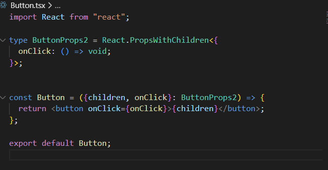

#### 1.2. ComponentProps
Ao criarmos um componente, podemos perder as funcionalidades de auto-completar do TypeScript. O TypeScript não é capaz de prever quais elementos ou propriedades estão sendo utilizados dentro do nosso componente.
Com o React.ComponentProps<'tag'>, podemos informar que tipo de propriedades aquele componente deve ter.

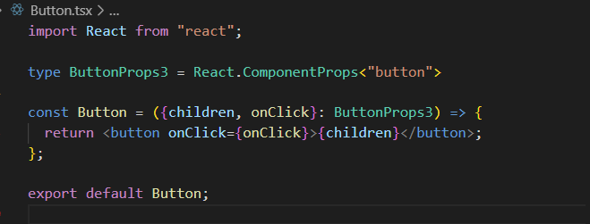

Caso eu queira utilizar uma propriedade que não é de botão:

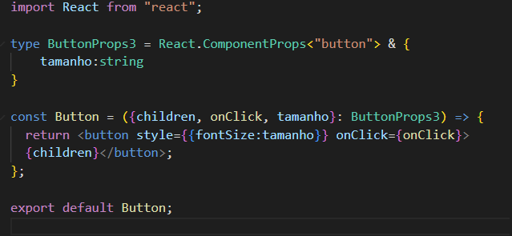

Componente onde estou renderizando o botão:

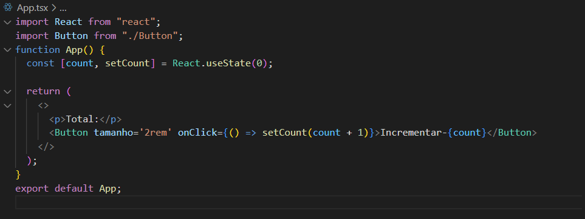

#### 1.3. Desestruturação
É comum desestruturarmos as propriedades na função.

Sem desestruturação:

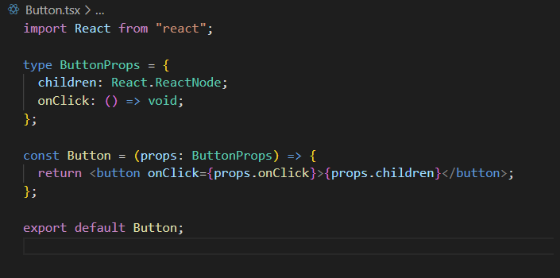

Com desestruturação:

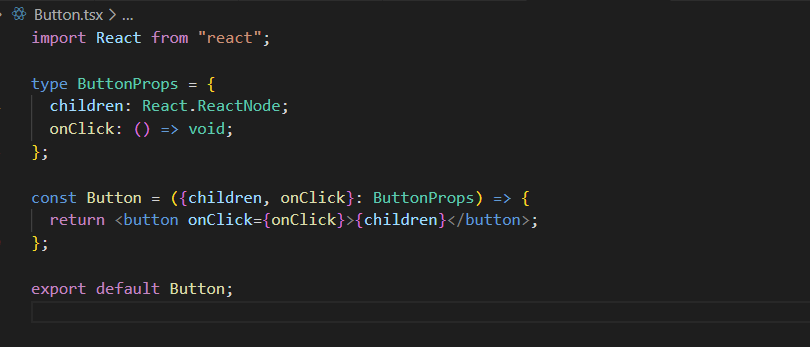

#### 1.3.1. ...props ou ...rest
Para não precisarmos ficar anotando cada propriedade nova, basta usar ...props (ou ...rest):

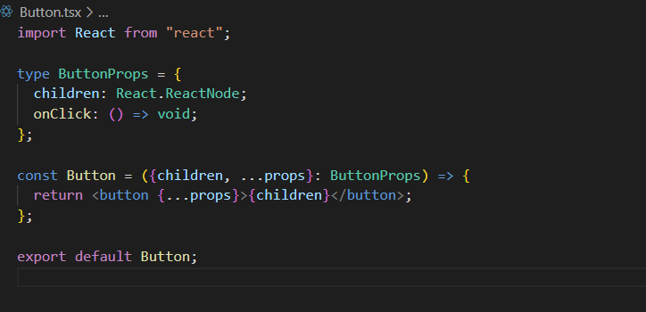

#### 1.4. Propriedade opcional
Basta inserir um ponto de interrogação na propriedade para torná-la opcional:

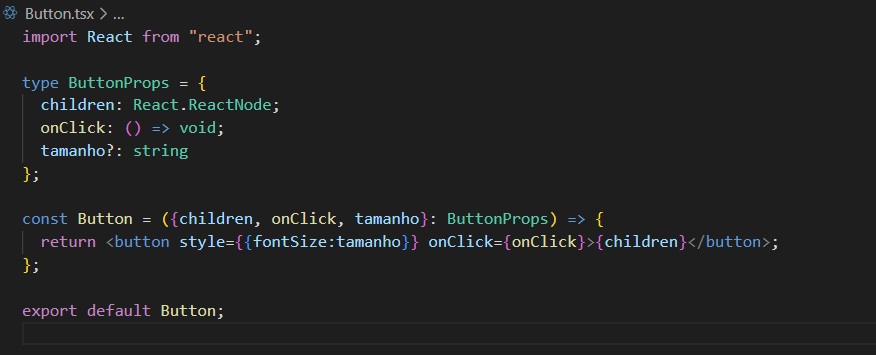

### 2. Interfaces e tipos
As interfaces de React com TypeScript estão disponíveis diretamente no objeto React importado de React.

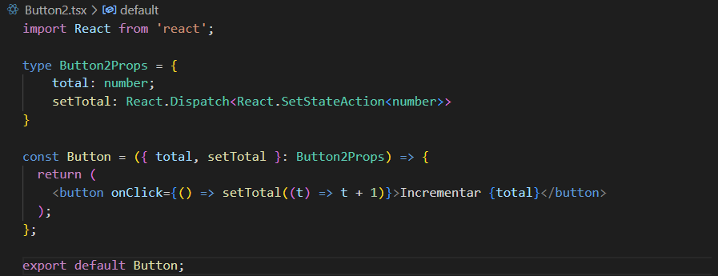

### 2.1. JSX.Element
Elemento que é retornado pelo componente (quando passa o mouse em cima da const do componente, aparece o tipo JSX.Element). Pode ser também: React.ReactElement e React.JSX.Element. Não precisamos anotar, pois o React já infere o mesmo.

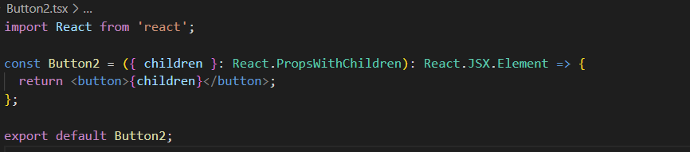

### 3. Eventos
Não confunda, um evento onClick no React é um evento próprio do React e não um evento nativo do JavaScript. O correto é React.MouseEvent e não MouseEvent.

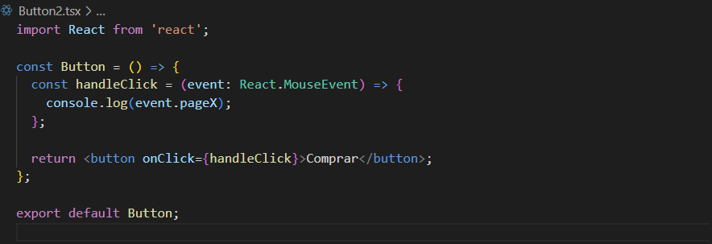

Aqui informamos que o handleClick é um React.MouseEventHandler. Assim ele assume que event é um React.MouseEvent (com isso, não precisa anotar a propriedade, porque já se entende que, se essa é uma função do tipo _React.MouseEventHandler_, a propriedade é do tipo _React.MouseEvent_):

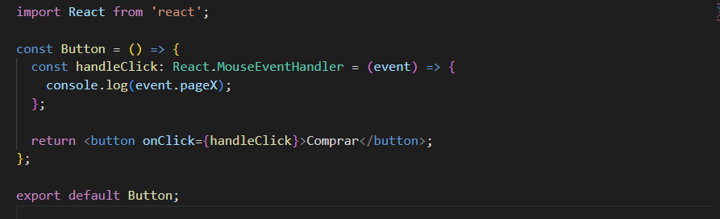
__OBS:__: O VS Code é o seu aliado, use as tooltips dele para identificar os tipos/interfaces.

#### 3.1. EventHandler
É possível definir o elemento em que o EventHandler será usado. Assim o currentTarget será definido corretamente.

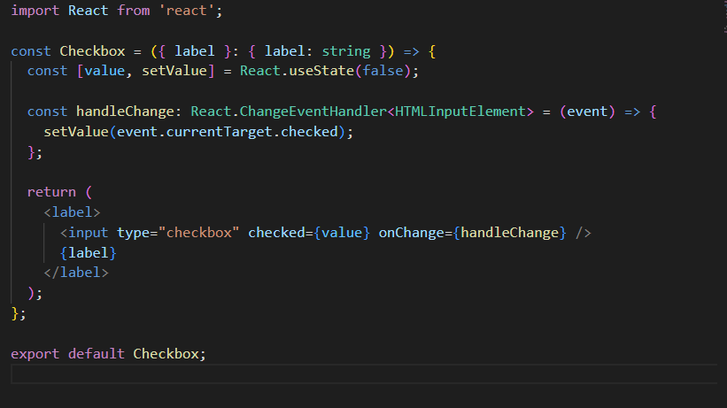
__OBS:__ passandoo o mouse em cima do onChange eu já consigo ver que ele é do tipo 
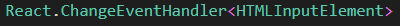

#### 3.1.1 Função Anônima
Se definirmos uma função anônima diretamente no evento, o TypeScript conseguirá inferir o tipo de evento e o elemento do mesmo.

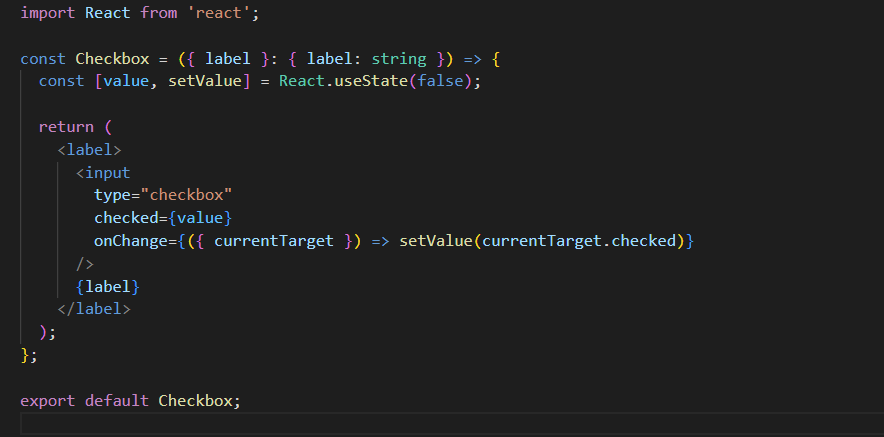

### 4. Hooks TSX
#### 4.1. useState
Generics para definir os possíveis tipos: useState<null | User>(null).

### 4.2. React.Dispatch
React.Dispatch<React.SetStateAction< tipo>> é o tipo da função que modifica o estado do hook useState.

Componente Button:

Onde estou chamando o componente:
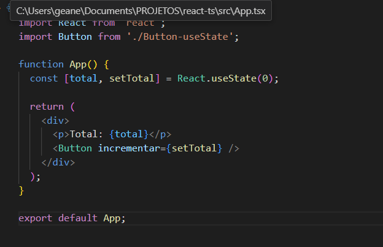