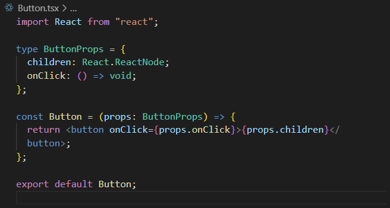
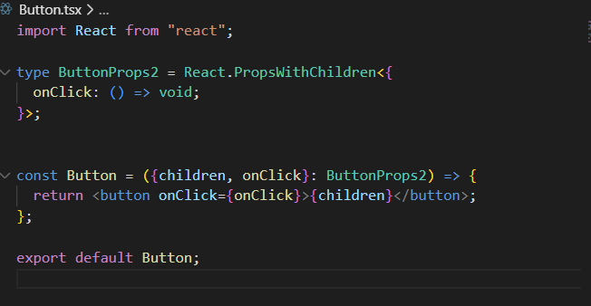
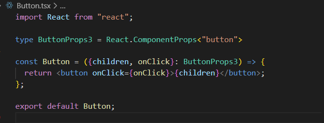
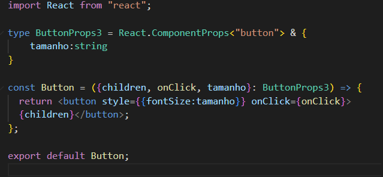
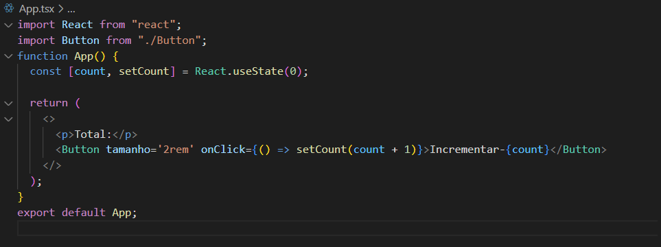
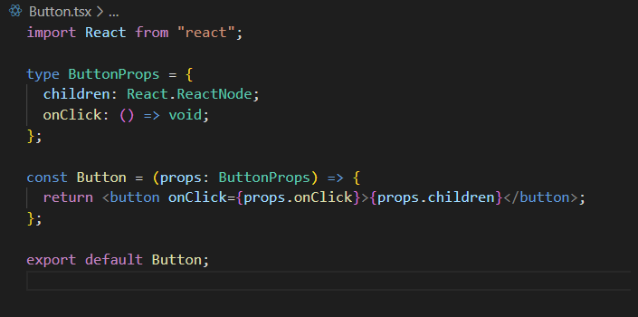
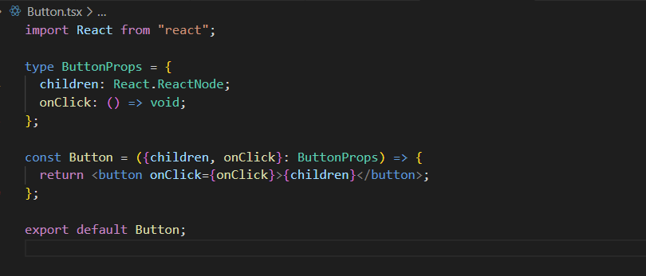
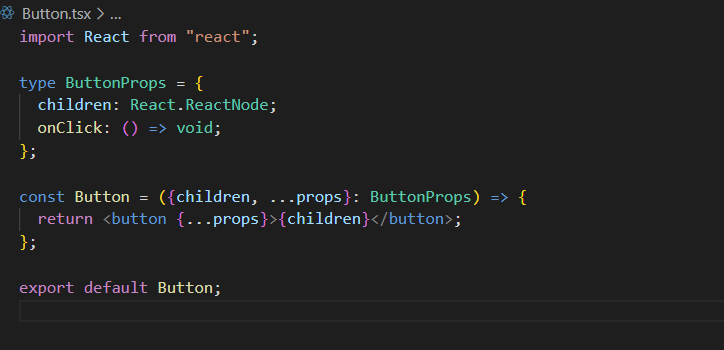
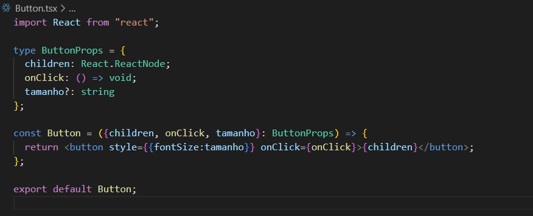

# TSX

### 1. Props
É preciso anotar as props que um componente recebe.

__Tipo ReactNode__: No ReactJS com TypeScript, ReactNode é um tipo que representa um elemento React, um array de elementos React ou uma string, número ou booleano. É definido no módulo react e pode ser usado para especificar o tipo de variável que pode conter qualquer um desses tipos.

### 1.1 PropsWithChildren
Tipo nativo do React que já anota a children das props. Nesse caso, não precisa tipar children.

### 1.2 ComponentProps
Ao criarmos um componente, podemos perder as funcionalidades de auto-completar do TypeScript. O TypeScript não é capaz de prever quais elementos ou propriedades estão sendo utilizados dentro do nosso componente.
Com o React.ComponentProps<'tag'>, podemos informar que tipo de propriedades aquele componente deve ter.

Caso eu queira utilizar uma propriedade que não é de botão:

Componente onde estou renderizando o botão:

### 1.3 Desestruturação
É comum desestruturarmos as propriedades na função.

Sem desestruturação:

Com desestruturação:

### 1.3.1 ...props ou ...rest
Para não precisarmos ficar anotando cada propriedade nova, basta usar ...props (ou ...rest):

### 1.4 Propriedade opcional
Basta inserir um ponto de interrogação na propriedade para torná-la opcional:

